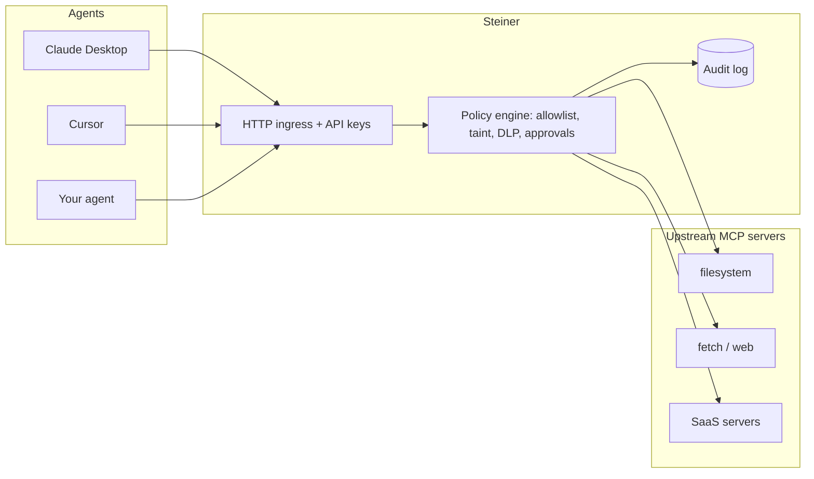

# Steiner

[](https://github.com/HT88-exe/steiner/actions/workflows/ci.yml)
[](LICENSE)
[](https://go.dev/)

**A security gateway for MCP (Model Context Protocol).** Steiner sits between
your agents and the MCP servers they use, and enforces policy on every tool
call: who may call what, a full audit trail, and containment when injection
succeeds.

Repository: [github.com/HT88-exe/steiner](https://github.com/HT88-exe/steiner)

Prompt-injection detection is probabilistic; no classifier catches everything.
Steiner takes the other side of the bet: **assume the model gets injected, and
make it non-catastrophic** at the tool-call layer — the one place with full
visibility into what an agent actually does.



## The lethal trifecta

An agent is dangerous when three things are true at once:

1. it can read **untrusted content** (a web page, an inbound email),
2. it has access to **private data**, and
3. it can **communicate externally** (send mail, post, call a webhook).

An injection payload hidden in untrusted content can turn steps 2 and 3 into
data exfiltration. You cannot reliably stop the model from being injected — but
a gateway in the data path can stop the consequence. Steiner tracks when a
session has read untrusted content (it becomes **tainted**) and blocks tainted
sessions from reaching tools with external side effects.

## Features

- **Transparent proxy** — one MCP endpoint; upstream tools exposed as
  `<upstream>_<tool>`.
- **Governance** — per-principal API keys, allow/deny lists, rate limits.
- **Containment** — session taint tracking, the trifecta rule, DLP on outbound
  arguments, custom rules, and approval for sensitive tools.
- **Detection as signal** — heuristics (encoding blobs, novel domains,
  injection phrasing) feed the policy engine; they do not replace it.
- **Audit trail** — append-only log with secret redaction, CLI queries, JSONL
  export, and a loopback trace viewer.
- **Credential vaulting** — upstream tokens live in Steiner config; agents never
  see them.

## Quickstart

Requires [Go 1.26+](https://go.dev/dl/) or install the binary:

```bash
go install github.com/HT88-exe/steiner/cmd/steiner@latest
```

```bash
steiner init                      # writes steiner.yaml
steiner keygen --name agent-a     # prints an API key (shown once)
steiner run                       # MCP at http://127.0.0.1:8385/mcp
```

Point an agent at `http://127.0.0.1:8385/mcp` with header
`Authorization: Bearer <key>`. Open `http://127.0.0.1:8386/` for the trace
viewer.

### Cursor / Claude Desktop (stdio)

```json
{
  "mcpServers": {
    "steiner": {
      "command": "steiner",
      "args": ["run", "--stdio", "--config", "/absolute/path/to/steiner.yaml"]
    }
  }
}
```

Stdio mode uses the `default_principal` (`local`). The admin API still listens on
the loopback port.

## Configuration

`steiner init` writes a commented starter config:

```yaml
listen: 127.0.0.1:8385
admin_listen: 127.0.0.1:8386

upstreams:
  - name: fs
    transport: stdio
    command: npx
    args: ["-y", "@modelcontextprotocol/server-filesystem", "."]

principals:
  - name: agent-a
    allow: ["fs_*"]
    deny:  ["fs_write_file"]
    rate_limit: { per_minute: 60, per_day: 2000 }

policy:
  untrusted_sources: ["web_*", "fetch_*", "browser_*"]
  external_sinks:    ["mail_*", "slack_*", "*_send", "*_post"]
  block_sinks_when_tainted: true
  block_secrets_in_args: true
  require_approval: ["shell_*"]
```

## Commands

| Command | Purpose |
| --- | --- |
| `steiner init` | Write a starter `steiner.yaml`. |
| `steiner run [--stdio] [--verbose]` | Run the gateway. |
| `steiner keygen --name <principal>` | Issue an API key. |
| `steiner audit [--json]` | Query the audit log. |
| `steiner trace [--config path]` | Serve the trace viewer (reads audit DB from disk). |
| `steiner approvals list \| approve <id> \| deny <id>` | Resolve pending approvals. |
| `steiner policy test <file>` | Run attack-scenario fixtures. |
| `steiner version` | Print version. |

## Containment eval

Ten scripted scenarios ship with the repo:

```bash
steiner policy test examples/attacks/scenarios.yaml
```

See [examples/attacks/scenarios.yaml](examples/attacks/scenarios.yaml) and
[examples/demo/injection-attack.md](examples/demo/injection-attack.md).

## Enforcement pipeline

```
allowlist -> rate limit -> policy (taint / DLP / approval) -> forward -> audit
```

Blocked calls return a **tool error with the reason** so the model can explain the
denial instead of retrying blindly. Taint is session-scoped and independent of
MCP protocol sessions (see [docs/spec-compat.md](docs/spec-compat.md)).

## Documentation

| Document | Description |
| --- | --- |
| [CHANGELOG.md](CHANGELOG.md) | Release history |
| [CONTRIBUTING.md](CONTRIBUTING.md) | Development setup |
| [SECURITY.md](SECURITY.md) | Vulnerability reporting |
| [docs/spec-compat.md](docs/spec-compat.md) | MCP spec compatibility |

## Current limitations (v0.1.0)

- Resource reads are audited but not policy-gated.
- Taint and rate-limit state are in-memory per process.
- Upstream credentials are static config values (no OAuth passthrough).
- Detectors are heuristic, not ML-based.

The trifecta rule is enforced deterministically on tool calls within a single
gateway process.

## Author

**Huzaifa Thakur** — [GitHub @HT88-exe](https://github.com/HT88-exe)

## License

Apache 2.0. See [LICENSE](LICENSE).
