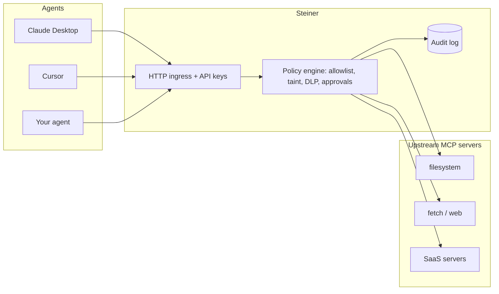

# Steiner

**A security gateway for MCP (Model Context Protocol).** Steiner sits between
your agents and the MCP servers they use, and enforces policy on every tool
call: who may call what, a full audit trail, and — the part that matters —
**containment**.

Prompt-injection detection is probabilistic; no classifier catches
everything, and attackers iterate. Steiner takes the other side of the bet:
**assume the model gets injected, and make it non-catastrophic.** It does that
at the one place with full visibility into what an agent actually *does* — the
tool-call layer.



## The core idea: the lethal trifecta

An agent is dangerous when three things are true at once:

1. it can read **untrusted content** (a web page, an inbound email),
2. it has access to **private data**, and
3. it can **communicate externally** (send mail, post, call a webhook).

An injection payload hidden in untrusted content can turn steps 2 and 3 into
data exfiltration. You cannot reliably stop the model from *being* injected —
but a gateway in the data path can stop the *consequence*. Steiner tracks when
a session has read untrusted content (it becomes **tainted**) and
deterministically blocks tainted sessions from reaching tools with external
side effects. The model can be fully compromised and the secrets still do not
leave.

## What you get

- **Transparent proxy.** Agents connect to Steiner as a single MCP server; it
  aggregates any number of upstream servers and namespaces their tools as
  `<upstream>_<tool>`. Existing clients work unchanged.
- **Governance.** Per-principal API keys, tool allow/deny lists, and
  rate/budget limits.
- **Containment (the differentiator).** Session taint tracking, the trifecta
  rule, built-in DLP on outbound arguments, custom argument rules, and
  human-in-the-loop approval for sensitive tools.
- **Detection, as signal not gospel.** Heuristics (exfil-encoding blobs, novel
  domains, injection phrasing) feed the policy engine rather than making
  promises they can't keep.
- **Audit-first.** Every decision — allowed or denied — is one append-only row
  with secrets redacted. Query it from the CLI, export JSONL to your SIEM, or
  watch it live in the built-in trace viewer.
- **Credential vaulting.** Upstream credentials live in Steiner's config;
  agents authenticate to Steiner and never see the real tokens.

## Quickstart

```bash
go install github.com/HT88-exe/steiner/cmd/steiner@latest

steiner init                      # writes an annotated steiner.yaml
steiner keygen --name agent-a     # prints an API key (shown once)
steiner run                       # serves MCP at http://127.0.0.1:8385/mcp
```

Point an agent at `http://127.0.0.1:8385/mcp` with header
`Authorization: Bearer <key>`, and open `http://127.0.0.1:8386/` for the live
trace viewer.

### Connecting Cursor / Claude Desktop

Steiner can also run over stdio, which is how desktop clients launch local MCP
servers. In your client's MCP config:

```json
{
  "mcpServers": {
    "steiner": {
      "command": "steiner",
      "args": ["run", "--stdio", "--config", "/absolute/path/to/steiner.yaml"]
    }
  }
}
```

Over stdio there is no HTTP auth, so calls use the `default_principal`
(`local`). The admin API and trace viewer still run on the loopback port.

## Configuration

`steiner init` writes a commented starter config. The shape:

```yaml
listen: 127.0.0.1:8385
admin_listen: 127.0.0.1:8386        # loopback only, enforced

upstreams:
  - name: fs
    transport: stdio
    command: npx
    args: ["-y", "@modelcontextprotocol/server-filesystem", "."]
  - name: linear
    transport: http
    url: https://mcp.linear.app/mcp
    headers:                         # vaulted: agents never see these
      Authorization: "Bearer ..."

principals:
  - name: agent-a
    allow: ["fs_*"]
    deny:  ["fs_write_file"]
    rate_limit: { per_minute: 60, per_day: 2000 }

policy:
  untrusted_sources: ["web_*", "fetch_*", "browser_*"]
  external_sinks:    ["mail_*", "slack_*", "*_send", "*_post"]
  block_sinks_when_tainted: true     # the trifecta rule
  block_secrets_in_args: true        # built-in DLP
  require_approval: ["shell_*"]
```

## Commands

| Command | Purpose |
| --- | --- |
| `steiner init` | Write a starter `steiner.yaml`. |
| `steiner run [--stdio] [--verbose]` | Run the gateway. |
| `steiner keygen --name <principal>` | Issue an API key for a principal. |
| `steiner audit [--principal --decision --tool --limit --json]` | Query the audit log; `--json` emits JSONL for a SIEM. |
| `steiner approvals list \| approve <id> \| deny <id>` | Resolve human-in-the-loop approvals. |
| `steiner policy test <file>` | Run attack-scenario fixtures against your policy. |

## Prove the containment claim

The repo ships a ten-scenario containment eval:

```bash
steiner policy test examples/attacks/scenarios.yaml
```

Each scenario is a sequence of tool calls asserting the gateway's decision.
They cover the trifecta, DLP over outbound arguments, approval gating, and —
importantly — that ordinary read-only work is never impeded. See
[examples/attacks/scenarios.yaml](examples/attacks/scenarios.yaml).

## Enforcement pipeline

Every tool call runs through:

```
allowlist -> rate limit -> policy (taint / DLP / approval) -> forward -> audit
```

A blocked call is returned to the model as a **tool error with the reason**,
not a protocol error, so the model can read why and explain it to the user
instead of blindly retrying.

Taint is **session-scoped**. Steiner mints its own session identity, so taint
state never depends on protocol-level sessions — which matters because the
2026-07-28 MCP revision removes them (see
[docs/spec-compat.md](docs/spec-compat.md)).

## Status and limitations

Steiner is young. Known v1 limitations:

- Resource reads are audited but not policy-gated (tool calls are the
  exfiltration surface that matters first).
- Taint state and rate-limit windows are in-memory per process; running
  multiple instances means independent state.
- Upstream credentials are static config values (no OAuth passthrough yet).
- Detectors are deliberately simple heuristics.

None of these weaken the trifecta guarantee, which is enforced on tool calls
in a single process.

## License

Apache 2.0. See [LICENSE](LICENSE).
